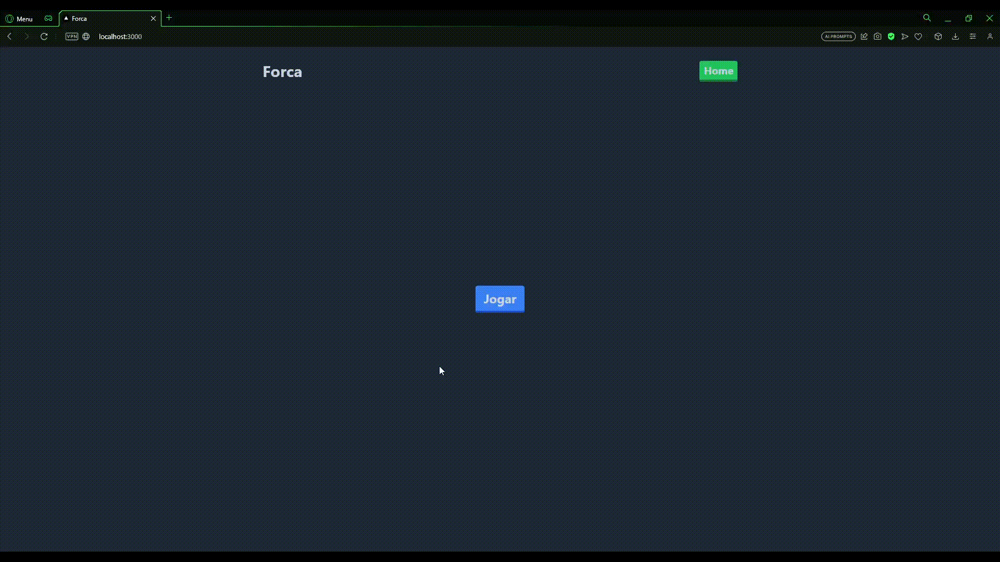

# Jogo da Forca
Bem-vindo ao Jogo da Forca em Next.js! Este é um aplicativo simples que permite jogar o clássico jogo da forca. As palavras são obtidas através da API do Dicionário Aberto (https://api.dicionario-aberto.net/index.html)



## Instalação
Siga as etapas abaixo para configurar o aplicativo em sua máquina:

Clone este repositório:

```bash
git clone https://github.com/JoaoRViana/forca.git
```
Acesse o diretório do projeto:

```bash
cd forca
```
Instale as dependências:

```bash
npm install
```
Configuração da API
O aplicativo já está configurado para acessar a API do Dicionário Aberto. Não é necessário fazer nenhuma configuração adicional.

Executando o Aplicativo
Após a instalação das dependências, você pode iniciar o aplicativo localmente com o seguinte comando:

```bash
npm run dev
```
O aplicativo estará disponível em http://localhost:3000 no seu navegador.
